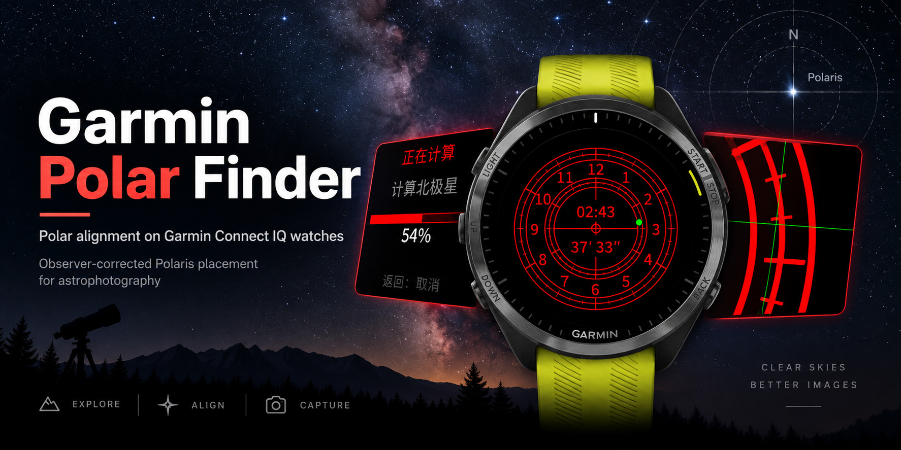

# Polar Finder

A Garmin Connect IQ watch app for polar alignment on the Forerunner 255 family
(`fr255`, `fr255s`, `fr255m`, and `fr255sm`) and Forerunner 965 (`fr965`).

**[Read the Polar Finder User Manual](docs/user-manual.md)**

## Requirements

- Garmin Connect IQ SDK managed by Garmin SDK Manager
- A signing key at `~/Library/Application Support/Garmin/ConnectIQ/developer_key.der`
- GNU Make
- A stable Rust toolchain with `monkeyc-fmt` **0.1.1** installed:
  `cargo install --locked --version 0.1.1 monkeyc-fmt`
- ImageMagick (`magick`) when regenerating the launcher icon
- [uv](https://docs.astral.sh/uv/) when checking, regenerating, or updating IERS data

The Makefile reads the active SDK from `~/Library/Application Support/Garmin/ConnectIQ/current-sdk.cfg`. Override `DEVELOPER_KEY` or `DEVICE` on the command line when needed.

## Commands

```sh
make format                     # format all nonignored Monkey C source files
make lint                       # check Monkey C and project XML formatting
make check-generated            # verify checked-in IERS output without refreshing data
make generate-iers              # regenerate IERS source from the checked-in snapshot
make update-iers                # explicitly download and replace the IERS snapshot
make build                      # compile DEVICE (fr965 by default)
make DEVICE=fr255s build        # compile one selected profile
make -j5 build-all              # compile all five devices in parallel
make package                    # export one all-device PolarFinder.iq package
make simulator
make DEVICE=fr255 run           # launch in the matching running simulator
make DEVICE=fr255s test         # compile and run tests on one profile
make test-profiles              # test representative 218, 260, and 454 profiles
make clean
```

`make simulator` starts Garmin's simulator. Run it before `make run` or
`make test`. Single-device builds, runs, and tests honor `DEVICE`; artifacts are
written to `bin/<device>/PolarFinder-<device>.prg`, with compiler intermediates
isolated per device so parallel builds do not share generated state.
Test PRGs remain at `bin/PolarFinder-tests-<device>.prg`.
`make test-profiles` serializes all three profiles even when invoked with `-j`,
because MonkeyDo clients share one simulator.
`make format` writes every tracked or untracked, nonignored `.mc` file.
`make lint` checks those files and the project XML without rewriting either.
Monkey C formatting uses the exactly pinned `monkeyc-fmt` **0.1.1** available
on `PATH`. Tests run `make format` before compilation.
`npx` runs the exactly pinned Prettier and XML plugin versions. Launcher PNGs
are regenerated from `artwork/launcher-icon.svg` when it changes: 65×65 for the
965 and dithered 40×40 family-qualified resources for the 64-color Forerunner
255 displays.

## Astrometry source layout

The `Astrometry` module is declared across `source/Astrometry*.mc`; callers
continue to use the same module without forwarding wrappers. `base.sourcePath`
includes these files automatically.

- `Astrometry.mc`: resumable `begin`/`cancel`/`step` lifecycle and result assembly.
- `AstrometrySeries.mc`: budgeted ephemeris, nutation, and CIO series evaluation.
- `AstrometryMath.mc`: shared constants, angles, vectors, and rotation matrices.
- `AstrometryTime.mc`: leap seconds, calendars, and time-scale conversions.
- `AstrometryEarthOrientation.mc`: Earth rotation, observer position, precession,
  and fundamental arguments.
- `AstrometryStars.mc`: catalog proper motion, parallax, deflection, and aberration.
- `AstrometryReticle.mc`: refraction, local pole geometry, and `reticleAt`.
- `AstrometryEphemerisData.mc`, `AstrometryNutationLuniSolarData.mc`,
  `AstrometryNutationPlanetaryData.mc`, and `AstrometryCioData.mc`: SOFA-derived
  coefficient tables, kept separate from the algorithms.

Keep coefficient order and numeric literal types intact when maintaining the
tables; the calculation intentionally uses both Float and Double precision.

## Bundled Earth data

The astrometry calculation uses bundled, read-only reference data:

- **Geoid:** NGA EGM96 (`us_nga_egm96_15.tif`) reduced to a global 15° lattice
  and bilinearly interpolated for MSL-to-ellipsoid height conversion.
- **Earth orientation:** IERS Bulletin A `finals2000A` prediction rows, MJD
  **61292–61659** (**2026-09-09–2027-09-11**), with DUT1 and polar motion
  (`xp`, `yp`) interpolated at the fractional UTC MJD. Dates outside this
  interval are rejected; the final 30 days are marked as nearing expiry.

`source/GeoidData.mc` is handwritten; `source/IersEopData.mc` is generated from
the single checked-in `data/iers/finals2000A-YYYY-MM-DD.txt` snapshot. Ordinary
builds and CI do not refresh IERS data. See
[Earth-data generation](docs/earth-data-generation.md) for ownership,
reproducible generation, and the explicit update procedure.
See [CI trust and build contract](docs/ci.md) for workflow triggers, signing
security, simulator tests, and build artifacts.

## Languages

- English (`eng`)
- Simplified Chinese (`zhs`)
- Traditional Chinese (`zht`)
